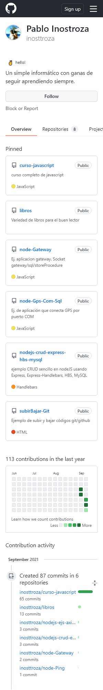

# Node.js Puppeteer y Scraping

Ejemplos de Puppeteer y Scraping a traves de Nodejs. Usando Cheerio.js, request-promise, async/await 
y otros conceptos de Javascript<br>

App. con ejemplos de Puppeteer y Scraping<br>
1-Puppeteer Captura Screenshots y Pdf de Website <br>
2-Scraping analizamos una web y exportamos la info a  txt,xlsx y csv.<br>
3-Scraping analizamos una web y dependiendo de precio enviamos un correo de aviso.<br>


## Installation
Para ejecutar la app. Primero instalar las siguientes dependencias npm:

```
$ npm install
$ npm run dev
```

## Modulos
1-cheerio<br>
2-cron<br>
3-fs-extra<br>
4-nodemailer<br>
5-puppeteer<br>
6-request<br>
7-request-promise<br>

## Website usadas
1- https://toscrape.com/ <br>
2- http://quotes.toscrape.com/ <br>
3- https://www.kokiri.cl/presta17/index.php?id_product=376&id_product_attribute=200&rewrite=audifonos-rojos-havit-h2582bt&controller=product&id_lang=2#/10-color-rojo <br>




